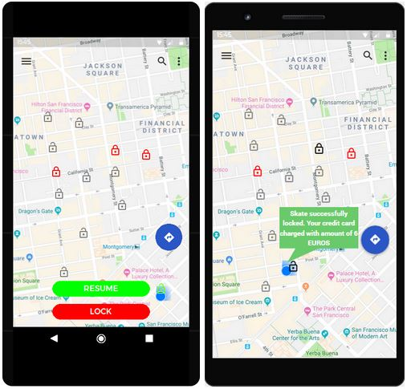
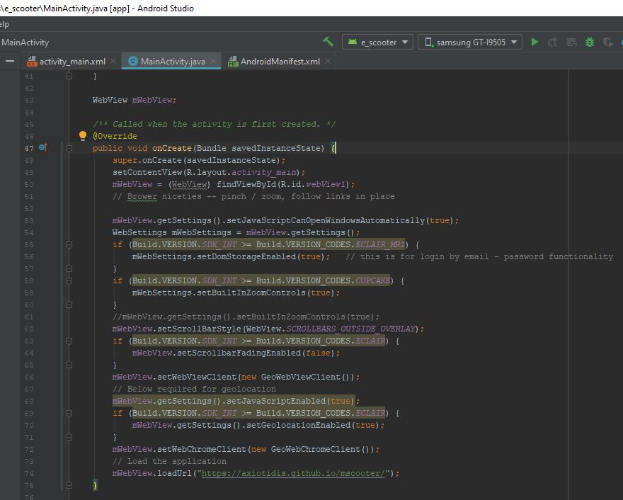
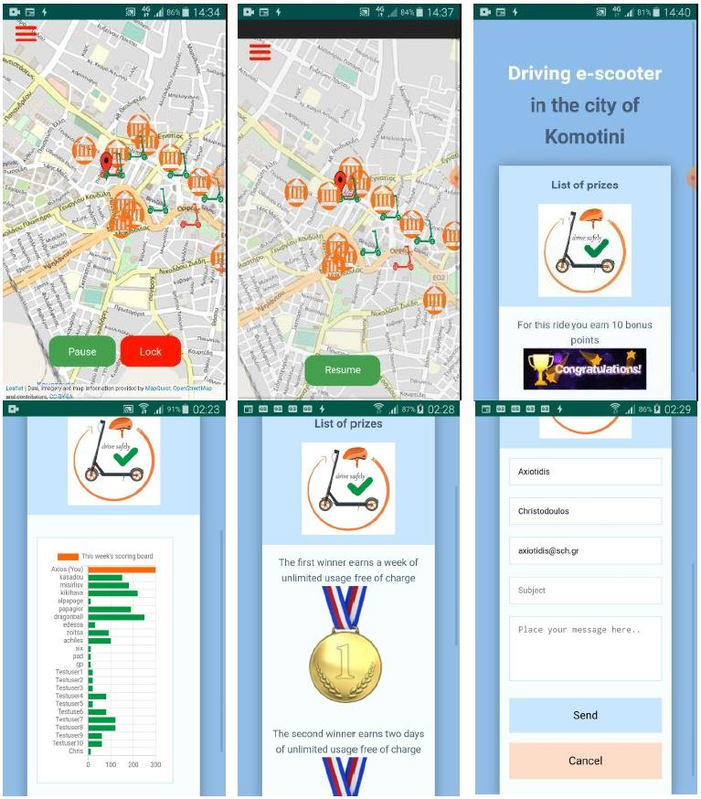
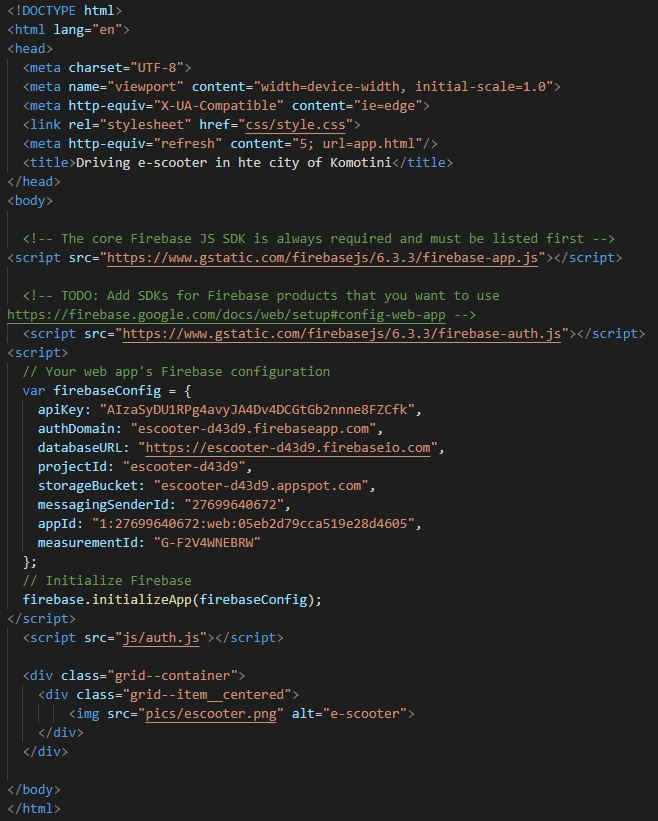
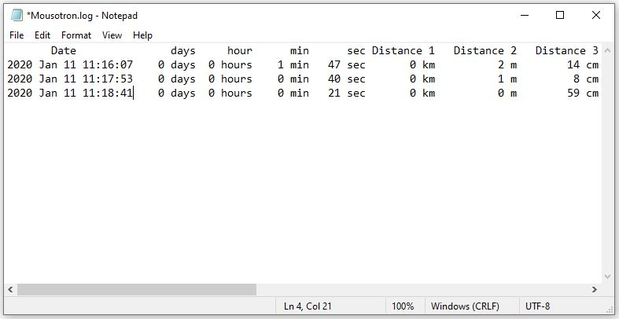
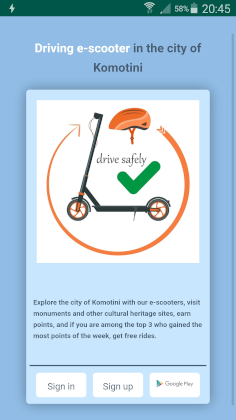
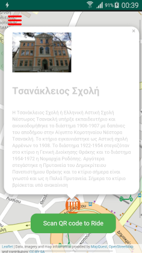

# Driving e-scooter in the city of Komotini

### Αξιωτίδης Χριστόδουλος, Παπαδόπουλος Γεώργιος, Σισμανίδης Χρήστος

### **Περίληψη**
Το τμήμα τεχνολογίας του δήμου Κομοτηνής, μας ανέθεσε να σχεδιάσουμε μια εφαρμογή για την ενοικίαση ηλεκτρικών πατίνι (e-scooters), που θα κινούνται σε περιοχή τουριστικού ενδιαφέροντος στο κέντρο της πόλης. 
Για το σκοπό αυτό μελετήσαμε σχετική βιβλιογραφία,  υλοποιήσαμε μια κινητή και μια web έκδοση της εφαρμογής, πραγματοποιήσαμε  αξιολόγηση αποτελεσματικότητας και ευχρηστίας με 5 χρήστες και τέλος υλοποιήσαμε και μια εφαρμογή η οποία εκτελείται σε ένα έξυπνο ρολόι (smartwatch) και περιλαμβάνει ένα υποσύνολο των λειτουργιών της κινητής εφαρμογής. 

### **Λέξεις κλειδιά**
e-scooters, παιχνιδοποίηση (gameficiation), html, javascript, firebase, android webview, leaflet map

### **1. Εισαγωγή**

Η υλοποίηση της έννοιας της “**έξυπνης πόλης**” με τη χρήση πληροφοριακών συστημάτων, αισθητήρων πάσης φύσεως ,έξυπνα” αντικείμενα, καθώς και άλλα στοιχεία ΤΠΕ, δημιουργεί υπηρεσίες που εξαπλώνονται σε όλους τους τομείς και σε όλα τα κοινωνικά πεδία ενός σύγχρονου αστικού περιβάλλοντος. 
Μια σημαντική διάσταση της “**έξυπνης πόλης**” είναι η μετακίνηση εντός του αστικού ιστού.Στη διεθνή βιβλιογραφία υπάρχουν πολλές προτάσεις για την υλοποίηση της “**έξυπνης μετακίνησης**” αρκετές από τις οποίες εφαρμόζονται ήδη στην πράξη. Μία άλλη διάσταση της smart city ξεδιπλώνεται στο τομέα της επίσκεψης στα μνημεία πολιτισμικής κληρονομιάς της πόλης, ο σχεδιασμός της εφαρμογής μας έχει ως σκοπό να εξυπηρετήσει την υλοποίηση ενός συγκερασμού των δύο τομέων στην πόλη της Κομοτηνής,  μια εφαρμογή σε επιτραπέζια (web), κινητή (mobile) και φορετή (smartwatch) μορφή την οποία θα τη χρησιμοποιούν οι επισκέπτες της πόλης για να ενοικιάζουν ηλεκτρικά πατίνια με τα οποία θα περιηγούνται στους πολιτιστικούς χώρους και στα ιστορικά μνημεία της Κομοτηνής. 

### **2. Προηγούμενη έρευνα**

Αναζητήσαμε σχετικές ερευνητικές εργασίες και εμπορικές εφαρμογές, παρατηρήσαμε ότι ενώ υπάρχουν αρκετές εμπορικές εφαρμογές ενοικίασης πατινιού (Lime, Bird, Circ, Tier, Voi κλπ), υπάρχουν ελάχιστες ερευνητικές εργασίες οι οποίες να συνδυάζουν την ενοικίαση πατινιών σε χώρους πολιτιστικού ενδιαφέροντος και με στοιχεία παιχνιδοποίησης, έτσι αναζητήσαμε βιβλιογραφία και σε σχετικά πεδία όσον αφορά την εφαρμογή που καλούμαστε να σχεδιάσουμε και να αξιολογήσουμε. 
Βασισμένοι λοιπόν στις εμπορικές εφαρμογές και στις εργασίες των Hamza Diaz [1], Kazhamiakin et al. [2] και Noguera J. M. et al. [3] καταλήξαμε στις βασικές σχεδιαστικές αρχές που θα πρέπει να ικανοποιεί.  

### **3. Ανάπτυξη της εφαρμογής**
**3.1. Βασικές σχεδιαστικές αρχές**

Μελετώντας τη βιβλιογραφία [1-3] καταλήξαμε στο ότι η εφαρμογή μας για να είναι εύχρηστη, χρήσιμη, ελκυστική και για πραγματώνει το σκοπό της δημιουργίας της, θα πρέπει να ικανοποιεί τις εξής βασικές σχεδιαστικές αρχές:

* Πριν την ενοικίαση ο χρήστης θα πρέπει να πληροφορείται για το **κόστος ενοικίασης** και τη **στάθμη της μπαταρίας** του πατινιού. 
* Θα πρέπει στο χάρτη να εμφανίζονται τα **διαθέσιμα** προς ενοικίαση πατίνια.  
* Η εφαρμογή θα πρέπει να επιτρέπει την εγγραφή και τη χρήση του πατινιού **μόνο σε ενήλικες χρήστες**. 
* Θα πρέπει η εφαρμογή να **προάγει την ασφάλεια**. 
* Στο χάρτη θα πρέπει να εμφανίζονται **markers με ενσωματωμένη πληροφορία** για τα σημεία πολιτιστικού ενδιαφέροντος [1]. 
* Στο χάρτη θα πρέπει να εμφανίζονται markers με τα σημεία που βρίσκονται **σταθμευμένα** τα πατίνια.
* Θα πρέπει να υπάρχει **διάκριση** (διαφορετικά εικονίδια) μεταξύ των markers που αντιπροσωπεύουν πατίνια και εκείνων που αντιπροσωπεύουν σημεία πολιτιστικού ενδιαφέροντος. 
* Οι κύριες λειτουργίες της εφαρμογής πρέπει να ακολουθούν την εξής σειρά: **Εύρεση** κοντινού πατινιού → **Σάρωση** QR code για να πραγματοποιηθεί η κράτηση → **Οδήγηση** πατινιού → **Πληρωμή** αντιτίμου [2]. 
* Στην κινητή εφαρμογή πρέπει να εμφανίζεται σε real-time **η τρέχουσα θέση του χρήστη** στο χάρτη.
* Στην εφαρμογή μας πέρα από τους συνηθισμένους τρόπους πληρωμής θα προσθέσουμε τη **δυνατότητα χρέωσης μέσω μηνύματος SMS**. 

**3.2. Κατασκευή ενδεικτικών οθονών με χρήση εργαλείων προτυποποίησης**

Η πρώτη φάση δημιουργίας της εφαρμογής είναι η κατασκευή ενός υποδείγματος και ο σχεδιασμός ενδεικτικών οθονών που να απεικονίζουν σε αδρές γραμμές της δυνατότητες της εφαρμογής. Για την ανάπτυξη της δικής μας εφαρμογής χρησιμοποιήθηκε το λογισμικό **justinmind prototyper** για τη web και mobile εκδοχή της εφαρμογής.

**3.2.1. Ενδεικτικές οθόνες της επιτραπέζιας εφαρμογής**

Παρακάτω παρατίθενται ενδεικτικές οθόνες της επιτραπέζιας εφαρμογής, στην εικόνα 1 βλέπουμε την αρχική οθόνη της επιτραπέζιας έκδοσης της εφαρμογής από την οποία μπορούμε να επιλέξουμε είτε **εγγραφή** (sign up εικόνα 2), είτε **είσοδο** στην εφαρμογή (sign in εικόνα 3), επίσης από εδώ μπορούμε να κατεβάσουμε μέσω του Google Play την κινητή εφαρμογή στο smartphone.

*Εικόνα 1. Αρχική οθόνη*

*Εικόνα 2. Οθόνη εγγραφής στην εφαρμογή*

*Εικόνα 3. Οθόνη σύνδεσης με την εφαρμογή*

Στην εικόνες 4 και 5 απεικονίζονται τα  ελεύθερα και τα δεσμευμένα πατίνια, εδώ μπορούμε να κάνουμε  **BOOK** αν μας ικανοποιούν τα στοιχεία του πατινιού που θέλουμε να κάνουμε κράτηση ή **CANCEL** αν δεν μας ικανοποιούν. Αν επιλέξουμε να κάνουμε κράτηση εμφανίζεται η οθόνη της εικόνας 6, η οποία περιέχει πληροφορίες σχετικά με τη διαδικασία ενοικίασης του πατίνι. Στις έξι αυτές εικόνες συνοπτικά παρασταίνονται οι βασικές λειτουργίες της εφαρμογής .  

*Εικόνα 4. Εμφάνιση των προς ενοικίαση πατινιών*

*Εικόνα 5. Επιλογή πατινιού και απεικόνιση σχετικών πληροφοριών*

*Εικόνα 6. Κράτηση πατινιού και πληροφορίες ενοικίασης*

**3.2.2. Ενδεικτικές οθόνες της κινητής εφαρμογής**

Ακολουθούν  ενδεικτικές οθόνες από το σχεδιασμό της κινητής εφαρμογής. Στην εικόνα 7 εμφανίζεται η αρχική οθόνη ενός κινητού τηλεφώνου με λειτουργικό σύστημα Android. όταν ο χρήστης κάνει κλικ στο εικονίδιο της εφαρμογής τότε εμφανίζεται η δεξιά οθόνη  μέσω της οποίας ο χρήστης μπορεί να κάνει εγγραφή (sign up) ή να  συνδεθεί με την εφαρμογή (sign in). 

*Εικόνα 7. Αρχική οθόνη κινητής εφαρμογής*

Στον χάρτη (εικόνα 8) εμφανίζεται το στίγμα του χρήστη,  τα διαθέσιμα πατίνια με μαύρο χρώμα καθώς και τα κρατημένα πατίνια με κόκκινο χρώμα. Ο χρήστης μπορεί να επιλέξει ένα από τα διαθέσιμα πατίνια, όταν φθάσει σ’ αυτό που έχει επιλέξει πατάει το πλήκτρο **SCAN QR CODE** που εμφανίζεται πάνω στον χάρτη και μεταφέρεται στην οθόνη που βλέπουμε δεξιά στην εικόνα 8, ο χρήστης εκεί μπορεί πατώντας το πλήκτρο με το εικονίδιο του κεραυνού να σαρώσει το QR code, εναλλακτικά μπορεί να το πληκτρολογήσει πατώντας το εικονίδιο του πληκτρολογίου. 

*Εικόνα 8. Χάρτης real-time και Scan QR Code* 

Όταν αναγνωριστεί το serial number του πατινιού τότε εμφανίζεται η αριστερή οθόνη της εικόνας 9 καθώς και χρήσιμες πληροφορίες σχετικά με αυτό (κατάσταση μπαταρίας, χρεώσεις), ο χρήστης επιλέγει **UNLOCK** αν επιθυμεί να ενοικιάσει το πατίνι, διαφορετικά επιλέγει **CANCEL**. Αν ο χρήστης επιλέξει **UNLOCK** τότε εμφανίζεται η οθόνη της δεξιάς εικόνας, το πατίνι ξεκλειδώνει και ο χρήστης ξεκινάει τη διαδρομή του. Αν ο χρήστης επιθυμεί μια ολιγόλεπτη στάση για να επισκεφθεί κάποιο αξιοθέατο επιλέγει **PAUSE** για να σταματήσει η χρέωση.

*Εικόνα 9. Πληροφορίες και ξεκλείδωμα πατινιού*     

Αν θέλει να συνεχίσει ο χρήστης μετά την παύση επιλέγει **RESUME** ενώ αν θέλει να τερματίσει τη διαδρομή του επιλέγει **LOCK** και εμφανίζεται η δεξιά οθόνη της εικόνας 10 η οποία πληροφορεί το χρήστη ότι το πατίνι κλειδώθηκε και έγινε η αντίστοιχη χρέωση. 

*Εικόνα 10. Λειτουργία Resume και διακοπή ενοικίασης*

**3.2.3. Ενδεικτικές οθόνες της φορετής εφαρμογής**

Η κατασκευή του υποδείγματος για φορετή συσκευή, για τη Smartwatch εκδοχή της εφαρμογής, έγινε με τη βοήθεια του on-line εργαλείου κατασκευής υποδειγμάτων **Proto.io**. Στην εικόνα 11 παρατίθονται σχετικές φωτογραφίες, η οθόνη καλωσορίσματος με το logo της εφαρμογής, έπειτα στην οθόνη του χάρτη πατώντας το πλήκτρο “**Tap to Ride**” ο χρήστης μεταφέρεται στην οθόνη που τον προτρέπει να πλησιάσει το smartwatch στο σημείο του πατινιού με την ένδειξη “**NFC**” προκειμένου να πάρει πληροφορίες για το συγκεκριμένο πατίνι. 

*Εικόνα 11. Οθόνες καλωσορίσματος, χάρτη και NFC*

Ο χρήστης μπορεί να επιλέξει “**Unlock**” για να ξεκλειδώσει το πατίνι και να ξεκινήσει η διαδρομή, όταν ο χρήστης επιθυμεί να σταματήσει και να κλειδώσει το πατίνι επιλέγει από την επόμενη οθόνη το πλήκτρο “**Lock**”, από την τελευταία οθόνη της εικόνας 12 ο χρήστης πληροφορείται το ποσό χρέωσης και πλησιάζει το smartwatch στο σημείο του πατινιού με την ένδειξη “**NFC**” προκειμένου να πληρώσει. 

*Εικόνα 12. Οθόνες Unlock, Lock και χρέωσης*

**3.3. Η αρχιτεκτονική της λύσης**

Για την υλοποίηση της βάσης δεδομένων αποφασίσαμε να χρησιμοποιήσουμε μια σύγχρονη προσέγγιση σε **Google Firebase** και να αξιοποιήσουμε τη διαθεσιμότητα και την αξιοπιστία των servers της Google. Επιπρόσθετα υποστηρίζει εγγενώς android εφαρμογές και παρέχει REST APIs για διάφορες γλώσσες όπως η **Javascript** την οποία θα χρησιμοποιήσουμε για τη συγγραφή της front end εφαρμογής. Για την κατασκευή της mobile εφαρμογής χρησιμοποιήσαμε ένα wrapper και συγκεκριμένα το **android webView**. Η desktop έκδοση της εφαρμογής θα τρέχει σε έναν κοινό browser που υποστηρίζει javascript και επιτρέπει τον γεωεντοπισμό. Στην αρχιτεκτονική του συστήματος που φαίνεται παρακάτω στην εικόνα 13 διακρίνεται η πλευρά του πελάτη (client side) με τα end devices (desktop, laptop, smartphone) και η πλευρά των servers. 

*Εικόνα 13. Η αρχιτεκτονική του συστήματος*

Η βάση δεδομένων αποτελείται από τα παρακάτω τρία τμήματα:

* **Poi** όπου φυλάσσονται τα στοιχεία των σημείων πολιτιστικού ενδιαφέροντος. 
* **Scooters** όπου φυλάσσονται τα στοιχεία των πατινιών. 
* **Users** όπου φυλάσσονται τα στοιχεία των χρηστών. 

Στις παρακάτω εικόνες απεικονίζεται η δομή της βάσης δεδομένων 

*Εικόνα 14. Τα 3 τμήματα της βάσης* 

*Εικόνα 15. Λεπτομέρειες του τμήματος της βάσης που αφορά τα σημεία πολιτιστικού ενδιαφέροντος*

*Εικόνα 16. Λεπτομέρειες του τμήματος της βάσης που αφορά τα πατίνια*

*Εικόνα 17. Λεπτομέρειες του τμήματος της βάσης που αφορά τους χρήστες*

**3.4. Υλοποίηση της εφαρμογής**

Για την υλοποίηση της επιτραπέζιας εφαρμογής (web)  χρησιμοποιήθηκε η γλώσσα **HTML** καθώς και η **javascript**, για τη διαμόρφωσης της εμφάνισης ιστοσελίδων χρησιμοποιήσαμε **CSS**. Σε αυτές τις γλώσσες στηρίχθηκε και η δημιουργία της φορετής (Smartwatch) εκδοχής της εφαρμογής ενώ για την κατασκευή της κινητής (mobile) εφαρμογής χρησιμοποιήθηκε επιπλέον ο wrapper **android webView**. 

**3.4.1. Υλοποίηση της επιτραπέζιας εφαρμογής**

Για την επιτραπέζια εφαρμογή δημιουργήθηκαν σελίδες **html**  στις οποίες μπορεί να γίνει μετάβαση από τη μία στην άλλη και οι οποίες επικοινωνούν με τη βάση δεδομένων με την ενσωμάτωση σε αυτές κατάλληλου κώδικα. Ο κώδικας βρίσκεται αναρτημένος σε δημόσιο αποθετήριο στο [github](https://github.com/axiotidis/escooter) και η ιστοσελίδα της εφαρμογής είναι προσβάσιμη από [εδώ](https://axiotidis.github.io/escooter/)

*Εικόνα 18. Κώδικας της σελίδας “index.html”*

*Εικόνα 19. Σύνοψη των οθονών της επιτραπέζιας εφαρμογής*

**3.4.2. Υλοποίηση της κινητής εφαρμογής**

Για το σχεδιασμό της mobile έκδοσης της εφαρμογής χρησιμοποιήθηκε το περιβάλλον προγραμματισμού **Android Studio** “τυλίγοντας” μια τροποποιημένη έκδοση της  web εφαρμογής με τη χρήση του wrapper **adnroid webView** έτσι ώστε να προσαρμοστεί στην περιορισμένη οθόνη αλλά και τις δυνατότητες ενός Smartphone καθώς και στις ιδιαιτερότητες του wrapper. 

Στην εικόνα 20 απεικονίζεται  το setup του adnroid webView που λειτουργεί ως wrapper για την html – javascript εφαρμογή που σχεδιάστηκε.

*Εικόνα 20. Tα περιεχόμενα του MainActivity.java εστιάζοντας στο setup του adnroid webView*

Ο κώδικας βρίσκεται αναρτημένος σε δημόσιο αποθετήριο στο [github](https://github.com/axiotidis/mscooter) και παρακάτω παραθέτουμε εικόνες από την κινητή εφαρμογή.

*Εικόνα 21. Σύνοψη των οθονών της κινητής εφαρμογής*

**3.4.3. Υλοποίηση της φορετής εφαρμογής**

Το smartwatch που χρησιμοποιήθηκε για τη δοκιμή της εφαρμογής ήταν ένα **Samsung Watch 46mm** στο οποίο ήταν εγκατεστημένη η εφαρμογή **Samsung Internet browser**, η οθόνη του smartwatch είναι στρόγγυλη και έχει ανάλυση **360 x 360 pixels** έτσι προσαρμόστηκαν ανάλογα τα περιεχόμενα, το zoom του χάρτη καθώς και το CSS αρχείο (**style.css**) που φροντίζει για την εμφάνιση της εφαρμογής.  Στην εικόνα 22 απεικονίζεται ο κώδικας της πρώτης σελίδας της εφαρμογής που είναι μια τυπική οθόνη καλωσορίσματος (**index.html**).

*Εικόνα 22. Ο κώδικας για την πρώτη σελίδα της Smart watch έκδοσης(index.html)*

Το πως απεικονίζεται στο έξυπνο ρολόι η σελίδα **app.html**  που περιέχει τον χάρτη φαίνεται στην εικόνα 23. Πατώντας στο πλήκτρο “**Tap to Ride**” που διακρίνεται εντός πρασίνου πλαισίου  ο χρήστης μεταβαίνει στην σελίδα **booking.html**. 

*Εικόνα 23. Smartwatch app, απεικόνιση της σελίδας app.html*

**3.5. Αξιολόγηση της εφαρμογής**

Εκτελέστηκε με τη συμμετοχή πέντε χρηστών αξιολόγηση  τόσο της κινητής όσο και desktop έκδοσης της εφαρμογής μας στο πεδίο της ευχρηστίας και της  αποτελεσματικότητας. 

Για την αξιολόγηση της αποτελεσματικότητας οι χρήστες επικεντρώθηκαν σε τρεις λειτουργίες της εφαρμογής, **εγγραφή** στην εφαρμογή(Sign Up), **σύνδεση και αναζήτηση** ελεύθερου πατινιού (Searching) και τέλος **κράτηση** πατινιού (Booking). Η εκτέλεση των λειτουργιών έγινε δύο φορές από το κάθε χρήστη. Για να καταγράψουμε τους χρόνους διεκπεραίωσης των εργασιών από τους χρήστες χρησιμοποιήσαμε το λογισμικό **Mousotron** για την desktop έκδοση της εφαρμογής και την εφαρμογή καταγραφής video **xRecorder** για τη mobile έκδοσή της, συμπεριφορικά  δεδομένα συγκεντρώσαμε επίσης και με τη χρήση των **google analytics** προσθέτοντας τον ανάλογο κώδικα στην εφαρμογή μας. Το λογισμικό mousotron έχει την ικανότητα να παράγει ένα **log file** τύπου text, η εφαρμογή xRecorder καταγράφει σε αρχείο video ότι συμβαίνει στην οθόνη του smart phone, ενώ το Google Analytics προσφέρει ένα dashboard μέσω του οποίου μπορούμε να συγκεντρώσουμε πληροφορίες σχετικά με τη δραστηριότητα των χρηστών στην κινητή εφαρμογή μας, να δούμε στοιχεία όπως  είναι η προβολή ανά τίτλο σελίδας και κατηγορία οθόνης,  τον χρόνο που έμειναν οι χρήστες σε αυτές τις σελίδες ξεχωριστά, το ποσοστό χρηστών ανά κατηγορία συσκευής, την προτίμηση τους ως προς τα λειτουργικά συστήματα για τη χρήση της εφαρμογής, τον χρόνο χρήσης της εφαρμογής, κτλ. 

*Εικόνα 24.  Εντός κόκκινου πλαισίου ο κώδικας για τη χρήση των Google Analytics ενσωματωμένος στο header των HTML αρχείων*

*Εικόνα 25. Log file τύπου text  δημιουργημένο από το λογισμικό Mousotron*

*Εικόνα 26. Χρήση της εφαρμογής καταγραφής video ΧRecorder*

Πραγματοποιήσαμε αξιολόγηση της ευχρηστίας σε διάφορα σημεία του κέντρου της Κομοτηνής για την κινητή εφαρμογή και σε οικίες ή χώρους εργασίας για τη desktop εφαρμογή. Για τη διαδικασία των πειραμάτων χρησιμοποιήθηκε ένα κινητό τηλέφωνο τύπου smart phone και ένας φορητός υπολογιστής. Η χρήση του πατινιού προσομοιώθηκε από γρήγορο βάδισμα.  O κάθε χρήστης χρησιμοποίησε αρχικά την κινητή και στη συνέχεια την desktop έκδοση της εφαρμογής για να επιτελέσει δύο φορές μια σειρά λειτουργιών  που του δόθηκαν εγγράφως. Μετά το τέλος των δύο κύκλων της εκτέλεσης του σεναρίου κάθε έκδοσης της εφαρμογής, ο χρήστης συμπλήρωσε ένα ξεχωριστό για την κάθε έκδοση ερωτηματολόγιο που σχεδιάστηκε σε google forms με σκοπό την αξιολόγηση της ευχρηστίας.

*Εικόνα 27. Διάγραμμα απαντήσεων των χρηστών  μιας εκ των ερωτήσεων*

### **4. Αποτελέσματα αξιολόγησης και επανασχεδιασμός**

**4.1 Μια επιγραμματική αξιολόγηση των αποτελεσμάτων**

Από την έρευνα και τις μετρήσεις που κάναμε για την αξιολόγηση της **αποτελεσματικότητας** της εφαρμογής έχουμε να παρατηρήσουμε τα εξής: 

* Οι χρήστες στη δεύτερη προσπάθεια (try 2) πέτυχαν γενικά καλύτερους χρόνους στην εκτέλεση των λειτουργιών, αυτό συνέβη και στην κινητή και στη desktop έκδοση της εφαρμογής. Γεγονός που δείχνει ότι η εφαρμογή μαθαίνεται εύκολα από τους χρήστες. 

* Από τις λειτουργίες που κλήθηκαν να εκτελέσουν οι χρήστες αυτή που τους πήρε περισσότερο χρόνο είναι η λειτουργία Sign Up, ειδικά στην κινητή έκδοση της εφαρμογής. Εστιάζοντας στην κινητή έκδοση της εφαρμογής εκτιμούμε ότι εν μέρει αυτή η καθυστέρηση οφείλεται στη δυσκολία πληκτρολόγησης των στοιχείων των χρηστών μέσω του soft keyboard. Παρατηρώντας στη συνέχεια τα videos στα οποία καταγράψαμε τις κινήσεις των χρηστών, διαπιστώσαμε επίσης ότι κατά την πρώτη επαφή του χρήστη με την κινητή εφαρμογή δε γίνονται αμέσως αντιληπτά τα buttons Sign Up και Sign In και ο χρήστης θα πρέπει να “σύρει” την οθόνη προς τα επάνω για να αποκαλυφθούν. Μια δεύτερη παρατήρηση από την εξέταση των videos έχει να κάνει με τη δυσκολία που συνάντησαν οι χρήστες στην εισαγωγή της ημερομηνίας γέννησης με βάση την οποία ελέγχουμε αν ο χρήστης είναι ενήλικος ή όχι.  

 Στον τομέα της **ευχρηστίας**, αναλύοντας τις απαντήσεις των χρηστών στα ερωτηματολόγια έχουμε να πούμε ότι οι χρήστες γενικά έκριναν θετικά την εφαρμογή μας. Θα πρέπει να σημειώσουμε όμως τα παρακάτω:  

* Οι πληροφορίες σχετικά με τα σημεία πολιτιστικού ενδιαφέροντος που εμφανίζονται ως popup όταν κάνουμε κλικ στο αντίστοιχο εικονίδιο κρίθηκαν ως ανεπαρκείς. 

* Οι χρήστες θεώρησαν στην desktop έκδοση της εφαρμογής ότι δεν ήταν και τόσο εύκολο να εντοπίσουν ένα κοντινό ελεύθερο πατίνι. Αυτό είναι αναμενόμενο διότι δεν εμφανίζεται στην desktop εφαρμογή το στίγμα του χρήστη στο χάρτη με την ίδια ακρίβεια που εμφανίζεται στην κινητή. 

* Οι χρήστες ειδικά στην κινητή έκδοση της εφαρμογής δε βρήκαν χρήσιμη τη λειτουργία της χρέωσης μέσω SMS. Αυτό εκτιμούμε ότι οφείλεται στο γεγονός ότι οι χρήστες που συμμετείχαν είναι νέοι σε ηλικία και το τεχνολογικό τους υπόβαθρο είναι υψηλό, χρησιμοποιούν με ευχέρεια smart phones και ηλεκτρονικούς υπολογιστές και είναι περισσότερο εξοικειωμένοι σε πληρωμές μέσω paypal και πιστωτικών καρτών. Αν ανάμεσα στους χρήστες που δοκίμασαν την εφαρμογή, ήταν και χρήστες μεγαλύτερης ηλικίας, με χαμηλότερο τεχνολογικό υπόβαθρο ή χρήστες με συμβατικά κινητά τηλέφωνα τότε πιστεύουμε ότι η επιλογή “πληρωμή μέσω SMS” θα ήταν ελκυστική. 

Στα θετικά στοιχεία θα πρέπει να αναφέρουμε ότι όλοι οι χρήστες απάντησαν πως είναι απαραίτητο το προστατευτικό κράνος κατά τη χρήση του πατινιού, άρα το moto μας Drive Safely σε συνδυασμό με το εικονίδιο του κράνους είχε θετικό αντίκτυπο σ’ αυτούς. 

**4.2 Αλλαγές στο σχεδιασμό**

Παρατηρήθηκε ότι στην κινητή έκδοση της εφαρμογής **κρύβονταν** τα buttons **Sign in** & **Sign up** από το χρήστη, για να ξεπεραστεί το πρόβλημα αυτό ανασχεδιάστηκε η ιστοσελίδα index.html μικραίνοντας ανάλογα το μέγεθος των γραμμάτων.

*Εικόνα 28. Ανασχεδιασμός της ιστοσελίδας index.html* 

Ο τρόπος δήλωσης της ηλικίας του χρήστη για λόγους ασφαλείας και συμμόρφωσης με τον Κ.Ο.Κ. και τους νόμους του κράτους όταν κάνει εγγραφή στην εφαρμογή θα αλλαχθεί, δεν θα εισάγεται αλλά θα δηλώνεται μέσω ενός checkbox τόσο στην κινητή όσο και στη desktop έκδοση της εφαρμογής.  

*Εικόνα 29. Checkbox για την ηλικία και τους όρους χρήσης της εφαρμογής* 

Κάνοντας μια γενική θεώρηση των λειτουργιών και του σκοπού δημιουργίας της εφαρμογής κρίθηκε αναγκαία η προσθήκη πληροφοριών σχετικών με τα σημεία πολιτιστικού ενδιαφέροντος. Για το λόγο αυτό προστέθηκε στη βάση δεδομένων το πεδίο "**info**" και αλλάχθηκε ο  κώδικας που "φορτώνει" τα POIs στο χάρτη. 

*Εικόνα 30. Προσθήκη πεδίου “info” στη βάση δεδομένων*

*Εικόνα 31. Απεικόνιση πληροφοριών ιστορικών μνημείων σε μορφή  popup*

### **Αναφορές** 

1. Hamza Diaz, (June 2019), Electric Scooter Sharing Application, TFG EN ENGINYERIA INFORMÀTICA, ESCOLA D’ENGINYERIA (EE), UNIVERSITAT AUTÒNOMA DE BARCELONA (UAB) 

2. Kazhamiakin, R., Marconi, A., Martinelli, A., Pistore, M., & Valetto, G. (2016). A gamification framework for the long-term engagement of smart citizens. 2016 IEEE International Smart Cities Conference (ISC2). https://doi.org/10.1109/isc2.2016.7580746 

3. Noguera, J. M., Barranco, M. J., Segura, R. J., & Martínez, L. (2012). A mobile 3D-GIS hybrid recommender system for tourism. Information Sciences, 215, 37–52. https://doi.org/10.1016/j.ins.2012.05.010 
