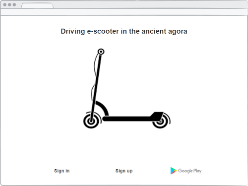
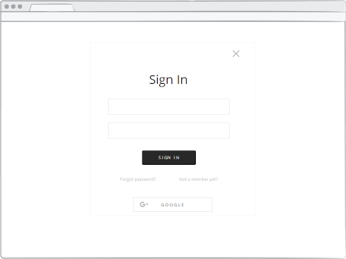
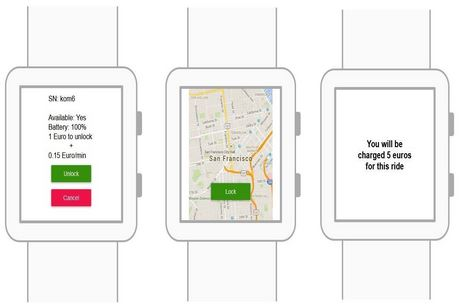

# Driving e-scooter in the city of Komotini

### Αξιωτίδης Χριστόδουλος, Παπαδόπουλος Γεώργιος, Σισμανίδης Χρήστος

##### Περίληψη
Το τμήμα τεχνολογίας του δήμου Κομοτηνής, μας ανέθεσε να σχεδιάσουμε μια εφαρμογή για την ενοικίαση ηλεκτρικών πατίνι (e-scooters), που θα κινούνται σε περιοχή τουριστικού ενδιαφέροντος στο κέντρο της πόλης. 
Για το σκοπό αυτό μελετήσαμε σχετική βιβλιογραφία,  υλοποιήσαμε μια κινητή και μια web έκδοση της εφαρμογής, πραγματοποιήσαμε  αποτελεσματικότητας και ευχρηστίας με 5 χρήστες και τέλος υλοποιήσαμε και μια εφαρμογή η οποία εκτελείται σε ένα έξυπνο ρολόι (smartwatch) και περιλαμβάνει ένα υποσύνολο των λειτουργιών της κινητής εφαρμογής. 

##### Λέξεις κλειδιά
e-scooters, παιχνιδοποίηση, html, javascript, firebase, android webview, leaflet map

##### 1. Εισαγωγή

Η υλοποίηση της έννοιας της “**έξυπνης πόλης**” με τη χρήση πληροφοριακών συστημάτων, αισθητήρων πάσης φύσεως ,έξυπνα” αντικείμενα, καθώς και άλλα στοιχεία ΤΠΕ, δημιουργεί υπηρεσίες που εξαπλώνονται σε όλους τους τομείς και σε όλα τα κοινωνικά πεδία ενός σύγχρονου αστικού περιβάλλοντος. 
Μια σημαντική διάσταση της “**έξυπνης πόλης**” είναι η μετακίνηση εντός του αστικού ιστού.-Στη διεθνή βιβλιογραφία υπάρχουν πολλές προτάσεις για την υλοποίηση της “**έξυπνης μετακίνησης**” αρκετές από τις οποίες εφαρμόζονται ήδη στην πράξη-. Μία άλλη διάσταση της smart city ξεδιπλώνεται στο τομέα της επίσκεψης στα μνημεία πολιτισμικής κληρονομιάς της πόλης, ο σχεδιασμός της εφαρμογής μας έχει ως σκοπό να εξυπηρετήσει την υλοποίηση ενός συγκερασμού των δύο τομέων στην πόλη της Κομοτηνής,  μια εφαρμογή σε επιτραπέζια (web), κινητή (mobile) και smart watch μορφή την οποία θα τη χρησιμοποιούν οι επισκέπτες της πόλης για να ενοικιάζουν ηλεκτρικά πατίνια με τα οποία θα περιηγούνται στους πολιτιστικούς χώρους και στα ιστορικά μνημεία της Κομοτηνής. 

##### 2. Προηγούμενη έρευνα

Αναζητήσαμε σχετικές ερευνητικές εργασίες και εμπορικές εφαρμογές, παρατηρήσαμε ότι ενώ υπάρχουν αρκετές εμπορικές εφαρμογές ενοικίασης πατινιού (Lime, Bird, Circ, Tier, Voi κλπ), υπάρχουν ελάχιστες ερευνητικές εργασίες οι οποίες να συνδυάζουν την ενοικίαση πατινιών σε χώρους πολιτιστικού ενδιαφέροντος και με στοιχεία παιχνιδοποίησης, έτσι αναζητήσαμε βιβλιογραφία και σε σχετικά πεδία όσον αφορά την εφαρμογή που καλούμαστε να σχεδιάσουμε. 
Βασισμένοι λοιπόν στις εμπορικές εφαρμογές και στις εργασίες των Hamza Diaz [1], Kazhamiakin et al. [2] και Noguera J. M. et al. [3] καταλήξαμε στις βασικές σχεδιαστικές αρχές που θα πρέπει να ικανοποιεί.  

##### 3. Ανάπτυξη της εφαρμογής
**3.1. Βασικές σχεδιαστικές αρχές**

Μελετώντας τη βιβλιογραφία [1-3] καταλήξαμε στο ότι η εφαρμογή μας για να είναι εύχρηστη, χρήσιμη, ελκυστική, για πραγματώνει το σκοπό της δημιουργίας της, θα πρέπει να ικανοποιεί τις εξής βασικές σχεδιαστικές αρχές:

* Πριν την ενοικίαση ο χρήστης θα πρέπει να πληροφορείται για το **κόστος ενοικίασης** και τη **στάθμη της μπαταρίας** του πατινιού. 
* Θα πρέπει στο χάρτη να εμφανίζονται τα **διαθέσιμα** προς ενοικίαση πατίνια.  
* Η εφαρμογή θα πρέπει να επιτρέπει την εγγραφή και τη χρήση του πατινιού **μόνο σε ενήλικες χρήστες**. 
* Θα πρέπει η εφαρμογή να **προάγει την ασφάλεια**. 
* Στο χάρτη θα πρέπει να εμφανίζονται **markers με ενσωματωμένη πληροφορία** για τα σημεία πολιτιστικού ενδιαφέροντος.[1] 
* Στο χάρτη θα πρέπει να εμφανίζονται markers με τα σημεία που βρίσκονται **σταθμευμένα** τα πατίνια.
* Θα πρέπει να υπάρχει **διάκριση** (διαφορετικά εικονίδια) μεταξύ των markers που αντιπροσωπεύουν πατίνια και εκείνων που αντιπροσωπεύουν σημεία πολιτιστικού ενδιαφέροντος. 
* Οι κύριες λειτουργίες της εφαρμογής πρέπει να ακολουθούν την εξής σειρά: **Εύρεση** κοντινού πατινιού → **Σάρωση** QR code για να πραγματοποιηθεί η κράτηση → **Οδήγηση** πατινιού → **Πληρωμή** αντιτίμου [2]. 
* Στην κινητή εφαρμογή πρέπει να εμφανίζεται σε real-time **η τρέχουσα θέση του χρήστη** στο χάρτη.
* Στην εφαρμογή μας πέρα από τους συνηθισμένους τρόπους πληρωμής θα προσθέσουμε τη **δυνατότητα χρέωσης μέσω μηνύματος SMS**. 

**3.2. Κατασκευή ενδεικτικών οθονών με χρήση εργαλείων προτυποποίησης**

Η πρώτη φάση δημιουργίας της εφαρμογής είναι η κατασκευή ενός υποδείγματος και ο σχεδιασμός ενδεικτικών οθονών που να απεικονίζουν σε αδρές γραμμές της δυνατότητες της εφαρμογής. Για την ανάπτυξη της δικής μας εφαρμογής χρησιμοποιήθηκε το λογισμικό **justinmind prototyper** για τη web και mobile εκδοχή της εφαρμογής.

**3.2.1. Ενδεικτικές οθόνες της επιτραπέζιας εφαρμογής**

Παρακάτω παρατίθενται ενδεικτικές οθόνες της επιτραπέζιας εφαρμογής, στην εικόνα 1 βλέπουμε την αρχική οθόνη της επιτραπέζιας έκδοσης της εφαρμογής από την οποία μπορούμε να επιλέξουμε είτε **εγγραφή** (sign up εικόνα 2), είτε **είσοδο** στην εφαρμογή (sign in εικόνα 3), επίσης από εδώ μπορούμε να κατεβάσουμε μέσω του Google Play την κινητή εφαρμογή στο smartphone.

*Εικόνα 1. Αρχική οθόνη*

*Εικόνα 2. Οθόνη εγγραφής στην εφαρμογή*

*Εικόνα 3. Οθόνη σύνδεσης με την εφαρμογή*

Στην εικόνες 4 και 5 απεικονίζονται τα  προς ενοικίαση ή ήδη ενοικιασμένα πατίνια, εδώ μπορούμε να κάνουμε  **BOOK** αν μας ικανοποιούν τα στοιχεία του πατινιού και θέλουμε να κάνουμε κράτηση ή **CANCEL** αν δεν μας ικανοποιούν. Αν επιλέξουμε να κάνουμε κράτηση εμφανίζεται η οθόνη της εικόνας 6, η οποία περιέχει πληροφορίες σχετικά με τη διαδικασία ενοικίασης του πατίνι. Στις έξι αυτές εικόνες συνοπτικά παρασταίνονται οι βασικές λειτουργίες της εφαρμογής .  

*Εικόνα 4. Εμφάνιση των προς ενοικίαση πατινιών*

*Εικόνα 5. Επιλογή πατινιού και απεικόνιση σχετικών πληροφοριών*

*Εικόνα 6. Κράτηση πατινιού και πληροφορίες ενοικίασης*

**3.2.2. Ενδεικτικές οθόνες της κινητής εφαρμογής**

Ακολουθούν  ενδεικτικές οθόνες από το σχεδιασμό της κινητής εφαρμογής. Στην εικόνα 7 εμφανίζεται η αρχική οθόνη ενός κινητού τηλεφώνου με λειτουργικό σύστημα Android. όταν ο χρήστης κάνει κλικ στο εικονίδιο της εφαρμογής τότε εμφανίζεται η δεξιά οθόνη  μέσω της οποίας ο χρήστης μπορεί να κάνει εγγραφή (sign up) και να  συνδεθεί με την εφαρμογή (sign in). 

*Εικόνα 7. Αρχική οθόνη κινητής εφαρμογής*

Στον χάρτη -εικόνα 8- εμφανίζεται το στίγμα του χρήστη,  τα διαθέσιμα πατίνια με μαύρο χρώμα καθώς και τα κρατημένα πατίνια με κόκκινο χρώμα. Ο χρήστης μπορεί να επιλέξει ένα από τα διαθέσιμα πατίνια, όταν φθάσει σ’ αυτό που έχει επιλέξει πατάει το πλήκτρο **SCAN QR CODE** που εμφανίζεται πάνω στον real-time χάρτη και μεταφέρεται στην οθόνη που βλέπουμε δεξιά στην εικόνα 8, ο χρήστης εκεί μπορεί πατώντας το πλήκτρο με το εικονίδιο του κεραυνού να σαρώσει το QR code, εναλλακτικά μπορεί να το πληκτρολογήσει πατώντας το εικονίδιο του πληκτρολογίου. 

*Εικόνα 8. Χάρτης real-time και Scan QR Code* 

Όταν αναγνωριστεί το serial number του πατινιού τότε εμφανίζεται η αριστερή οθόνη της εικόνας 9 καθώς και χρήσιμες πληροφορίες σχετικά με αυτό(κατάσταση μπαταρίας, χρεώσεις), ο χρήστης επιλέγει **UNLOCK** αν επιθυμεί να ενοικιάσει το πατίνι, διαφορετικά επιλέγει **CANCEL**. Αν ο χρήστης επιλέξει **UNLOCK** τότε εμφανίζεται η οθόνη της δεξιάς εικόνας, το πατίνι ξεκλειδώνει και ο χρήστης ξεκινάει τη διαδρομή του. Αν ο χρήστης επιθυμεί μια ολιγόλεπτη στάση για να επισκεφθεί κάποιο αξιοθέατο επιλέγει **PAUSE** για να σταματήσει η χρέωση.

*Εικόνα 9. Πληροφορίες και ξεκλείδωμα πατινιού*     

Αν θέλει να συνεχίσει ο χρήστης μετά την παύση επιλέγει **RESUME** ενώ αν θέλει να τερματίσει τη διαδρομή του επιλέγει **LOCK** και εμφανίζεται η δεξιά οθόνη της εικόνας 10 η οποία πληροφορεί το χρήστη ότι το πατίνι κλειδώθηκε και έγινε η αντίστοιχη χρέωση. 

*Εικόνα 10. Λειτουργία Resume και διακοπή ενοικίασης*

**3.2.3. Ενδεικτικές οθόνες της φορετής εφαρμογής**

Η κατασκευή του υποδείγματος για φορετή συσκευή, για τη Smartwatch εκδοχή της εφαρμογής, έγινε με τη βοήθεια του on-line εργαλείου κατασκευής υποδειγμάτων **Proto.io**. Στην εικόνα 11 παρατίθονται σχετικές φωτογραφίες, η οθόνη καλωσορίσματος με το logo της εφαρμογής, αυτόματα μετά από μερικά δευτερόλεπτα γίνεται redirect στην οθόνη του χάρτη, πατώντας το πλήκτρο “**Tap to Ride**” ο χρήστης μεταφέρεται στην οθόνη που τον προτρέπει να πλησιάσει το smartwatch στο σημείο του πατινιού με την ένδειξη “**NFC**” προκειμένου να πάρει πληροφορίες για το συγκεκριμένο πατίνι. 

*Εικόνα 11. Οθόνες καλωσορίσματος, χάρτη και NFC*

Ο χρήστης μπορεί να επιλέξει “**Unlock**” για να ξεκλειδώσει το πατίνι και να ξεκινήσει η διαδρομή, όταν ο χρήστης επιθυμεί να σταματήσει και να κλειδώσει το πατίνι επιλέγει από την επόμενη οθόνη το πλήκτρο “**Lock**”, από την τελευταία οθόνη της εικόνας 12 ο χρήστης πληροφορείται το ποσό χρέωσης και πλησιάζει το smart watch στο σημείο του πατινιού με την ένδειξη “**NFC**” προκειμένου να πληρώσει. 

*Εικόνα 12. Οθόνες Unlock, Lock και χρέωσης*